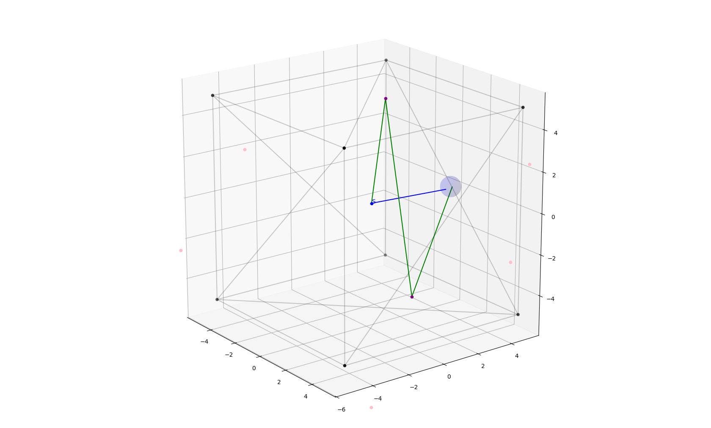

# VAE Project: Mirror Image Method

## Project Overview

This project simulates sound wave reflections in a 3D space using the mirror image method and visualizes the results. The main components of the project are the sound reflection simulation, ray tracing for sound paths, and visualization of the mesh and sound paths.

## Table of Contents

- [Directory Structure](#directory-structure)
- [Installation](#installation)
- [Usage](#usage)
- [Code Overview](#code-overview)
- [Additional Information](#additional-information)
- [Examples](#examples)

## Directory Structure

The project consists of the following main files:

- **main.py** : The entry point of the application. It initializes the parameters, creates objects, and runs the simulation.
- **mirror_image_method.py**: Implements the mirror image method for calculating image sources and simulating sound wave reflections.
- **visualization.py**: Contains the _MeshVisualizer_ class and methods for visualizing the 3D mesh and the simulated sound paths.
- **utils.py**: Utility classes and functions, including ray generation and target handling

## Installation

To run this project, you need to have Python 3 installed along with the following packages.

- numpy
- trimesh
- matplotlib

You can install the necessary dependencies using pip:

```sh
pip install numpy trimesh matplotlib
```

## Usage

To run the simulation, execute the 'main.py' script:

```sh
python main.py
```

The script will:

- Load a 3D mesh from the specified file.
- Generate random rays and calculate their reflections.
- Visualize the mesh and the sound paths.
- Print travel times and energy losses for the paths.

## Code Overview

### main.py

This is the entry point of the project. It initializes the simulation parameters, creates instances of necessary classes, and runs the visualization.

- Initializes the simulation parameters.
- Runs the `MirrorImageMethod` to calculate sound paths.
- Visualizes the mesh and paths using `MeshVisualizer`.

### mirror_image_method.py

This file implements the core algorithm of the mirror image method for simulating sound wave reflections

- **MirrorImageMethod Class**: Handles the core logic for calculating image sources and sound paths.
  - `__init__(file_path, source, target, order, reflection_coefficient)`: Initializes the method with mesh, source, and target information.
  - `find_image_sources(source, order, current_order)`: Recursively finds image sources.
  - `calculate_paths()`: Calculates the sound paths based on the image sources.

### visualization.py

Contains the `MeshVisualizer` class for plotting the 3D mesh and visualizing the sound paths.

- **MeshVisualizer Class**: Visualizes the 3D mesh and sound paths.
  - `plot_mesh()`: Plots the mesh, image sources, and reflections.
  - `plot_faces(ax)`: Plots the faces of the mesh.
  - `plot_reflections(ax)`: Plots the reflection paths.

### utils.py

Utility classes and functions used across the project.

- **Ray Class**: Represents a ray with origin, direction, and energy.

  - `generate_random_rays(origin, n, initial_energy)`: Generates random rays in a hemisphere.
  - `reflect(reflection_coefficient)`: Adjusts the energy based on reflection.
  - `apply_energy_loss(distance)`: Applies energy loss based on travel distance.

- **Target Class**: Represents the target with a position and radius.

  - `is_hitted_by_ray(ray)`: Checks if a ray hits the target.
  - `generate_random_coordinates()`: Generates random coordinates for the target.

- **SoundPath Class**: Stores and manages the path of a sound ray.
  - `add_ray(origin, direction, reflection_point, order, face_index, energy)`: Adds a ray to the path.
  - `calculate_travel_time(speed_of_sound)`: Calculates the travel time of each ray.
  - `calculate_energy_loss()`: Calculates the energy loss of each ray.
  - `calculate_total_travel_time(speed_of_sound)`: Calculates the travel time of the whole path.
  - `calculate_energy_loss_of_all()`: Calculates the energy loss of the whole path.

## Additional Information

### Mesh File

The mesh file used in the simulation (`cube5.obj`) should be placed in the `model` directory, which demonstrates a 5x5 cube with flipped normals. Alternatively, you can load any other .obj file in the `model`directory and update the _mesh_file_path_ parameter in `main.py` to use different or more complex mesh files.

### Visualization

The visualization component uses `matplotlib` to plot the mesh and the sound paths. The mesh vertices, image sources, and reflection paths are displayed in a 3D plot.

### Reflection Order

The _reflections_order_ parameter in `main.py` defines the number of reflections considered in the simulation. Adjusting this parameter affects the accuracy and performance of the simulation.

## Project Structure

The project consists of the following main files:

- **main.py** : The main script to run the project
- **room.py**: Contains the _Room_ class, which represents the room and handles the creation and plotting of the 3D room.
- **image_mirror_method.py**: Contains the _ImageMirrorMethod_ class, which calculates the reflections based on the Image-Mirror Method.
- **visualization.py**: Contains functions to plot and animate the reflections in the 3D space.

## Examples

Below are some visual examples of the reflections and ray tracing implemented by the `MirrorImageMethod`.


### 1. Face Indices


*Figure 1: Identification of face indices in the mesh. Each face of the mesh is labeled with its corresponding index, aiding in debugging and analysis.*

### 2. Mirror Image Method


*Figure 2: Illustration of the mirror image method. The plot shows the source, image sources, and the reflection points on the faces of the mesh.*

### 3. Ray Reflections


*Figure 3: Detailed view of ray reflections. This plot displays the paths of rays, including their reflection points and hit locations on the receiver.*

### 4. Initial 100,000 Reflections


*Figure 4: Visualization of the initial 100,000 reflections in the room up to the order of 2. The plot shows the complexity and density of the paths traced by the rays.*

### 5. Room Impulse Response


*Figure 5: Room Impulse Response showing the energy of the direct path and early reflections over time.*

### 6. Output Summary


*Figure 6: Output summary of the ray tracing simulation. This includes travel times and energy losses for various orders of reflections.*


